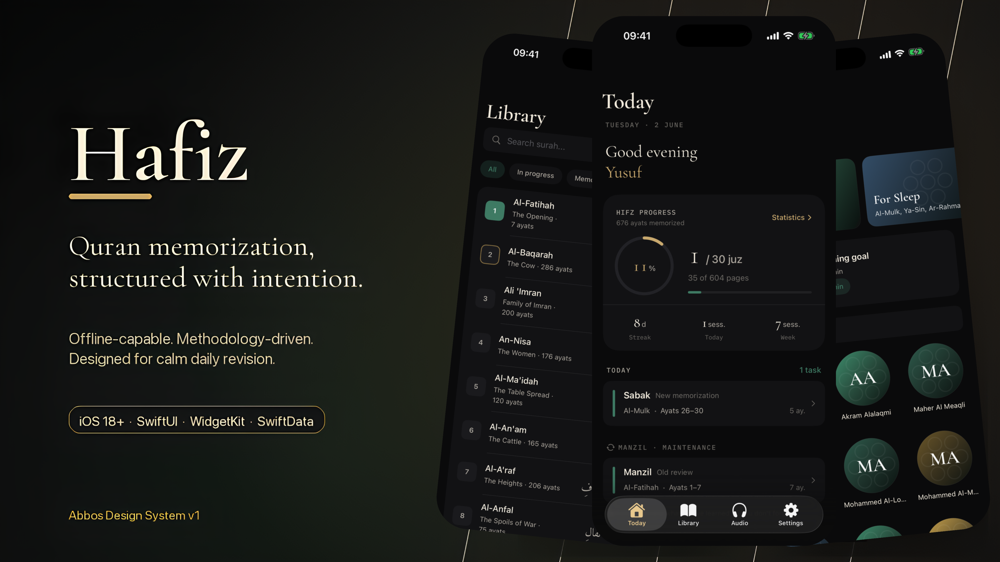
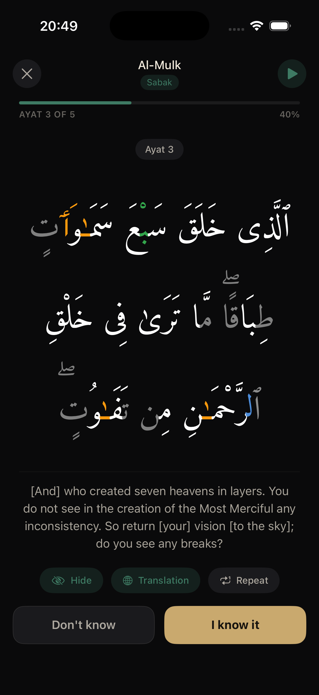
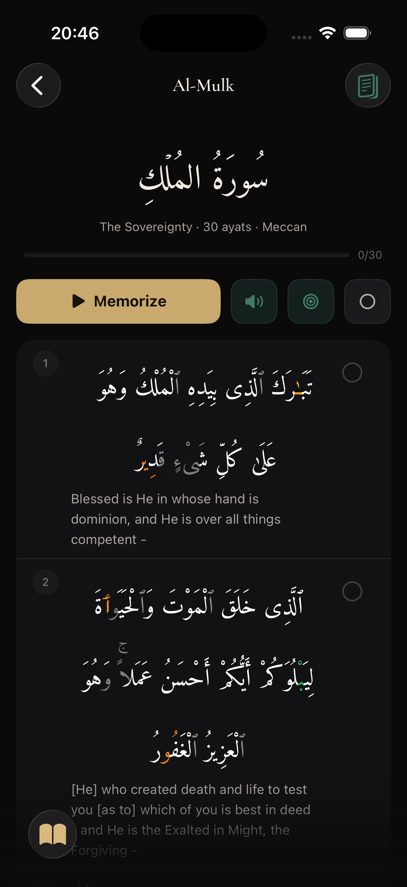
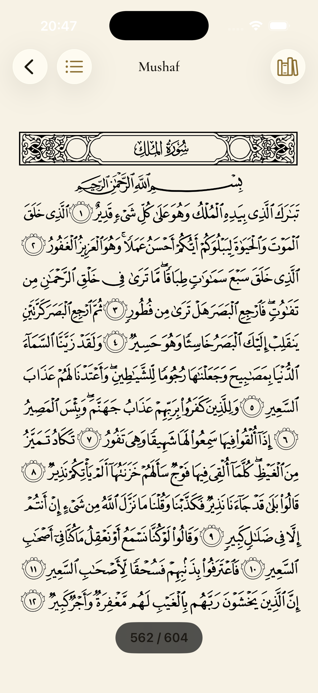
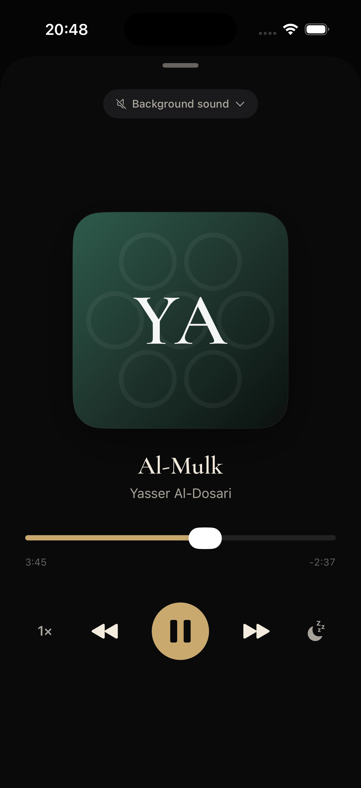

# Hafiz

### Quran memorization, structured with intention.

> This is the public showcase repository for Hafiz. The production iOS source code is private. This repository contains product material, screenshots, and public documentation only.

Hafiz is a calm, offline-capable Quran memorization system for Apple platforms. It is built around the traditional *sabaq* (new lesson), *sabqi* (recent review), and *manzil* (long-term revision) methodology.

No ads. No visual noise. Just a focused memorization workflow built around the Quran.

## Preview

| Focus | Surah | Mushaf | Audio |
| :---: | :---: | :---: | :---: |
|  |  |  |  |

## Features

- **Methodology-driven memorization:** Daily structure for *sabaq*, *sabqi*, and *manzil*.
- **Deterministic hifz engine:** Connected memorized passages are tracked as review units, not isolated checkmarks.
- **QUL Mushaf:** Page-accurate Quran reading with local QUL/QCF layout and glyph data. Madani Classic is bundled; Color Tajweed downloads and caches pages on demand.
- **Advanced audio:** Multiple reciters, repeat controls for memorization, lock-screen controls, background audio, ambient sound, and sleep timer.
- **iCloud sync:** Progress, plans, and settings sync privately across devices through the user's own iCloud account.
- **Statistics:** Streaks, accuracy, per-surah progress, practice heatmap, lifetime totals, and listening history.
- **Offline-capable:** Download integrity validation, disk-space checks, retry handling, and clear error states.
- **Widgets:** Home and Lock Screen widgets for today's task, streak, and daily verse.
- **Bilingual:** Russian and English interface, with translation choices independent from app language.
- **Accessible:** Dynamic Type, VoiceOver labels, Reduce Motion support, and readable high-contrast states.

## Design

Hafiz follows the **Abbos Design System v1**: a calm, dark-first visual language tailored for focus and presence.

- **Backgrounds:** Obsidian (`#0A0A0B`) and deep elevated surfaces (`#121214`).
- **Typography:** Warm parchment (`#F3EBDD`) paired with editorial *Cormorant Garamond* headings.
- **Accents:** Warm gold (`#C9A96E`) for primary actions and muted emerald (`#3E7A63`) for progress.
- **Motion:** Soft, restrained transitions. No bounce, glow, or visual noise.
- **Product tone:** Boutique, quiet, intentional.

## Technical Shape

The app is structured around a deterministic memorization engine with domain logic separated from SwiftUI presentation.

- Versioned local persistence with SwiftData migrations.
- Private CloudKit sync for user progress and settings.
- WidgetKit snapshot bridge through an App Group.
- AVFoundation-based recitation playback.
- Background URLSession downloads for audio and Mushaf resources.
- StoreKit 2 optional support purchases.
- Unit-tested memorization engine, scheduler, migrations, and consistency rules.

## Roadmap

- [x] Core memorization engine
- [x] Bundled Madani Mushaf and on-demand Tajweed pages
- [x] Advanced audio playback
- [x] Home and Lock Screen widgets
- [x] Russian and English localization
- [x] Accessibility pass
- [x] Offline validation and error states
- [x] iCloud sync with CloudKit
- [x] Versioned data migrations
- [ ] App Store 1.0 release
- [ ] iPad experience hardening
- [ ] Revision Coach

## Privacy

Hafiz has no accounts, no ads, and no cross-app tracking. Anonymous, privacy-first product analytics may be used to understand feature usage and improve the app. Memorization progress and settings stay on device and, if iCloud is enabled, sync through the user's private iCloud account.

See [Privacy Policy](docs/privacy.html).

## Attribution

Hafiz uses publicly available Quran text, Mushaf layout resources, translations, and recitations. Mushaf data is based on Quranic Universal Library (QUL) resources. Translations and recitations are credited to their respective rights holders.

This project is independent and is not affiliated with any official Quran publishing body, recitation provider, or data source.

## License

All rights reserved. This showcase repository does not grant rights to copy, redistribute, reuse, or reverse-engineer the app, assets, design system, or production source code.
